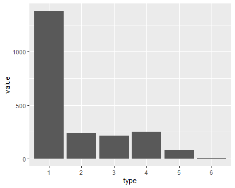
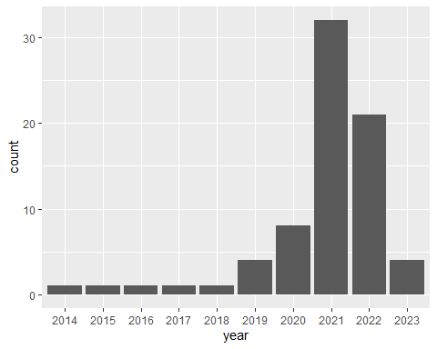
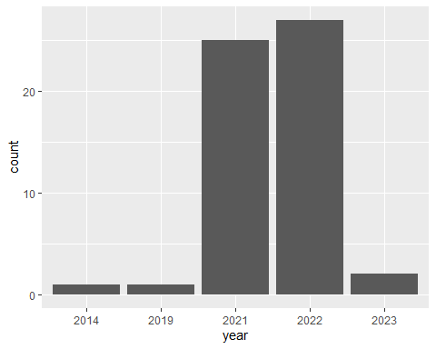
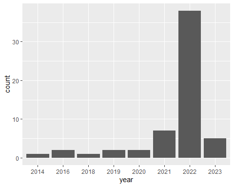
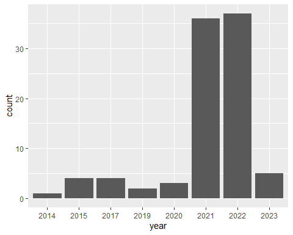
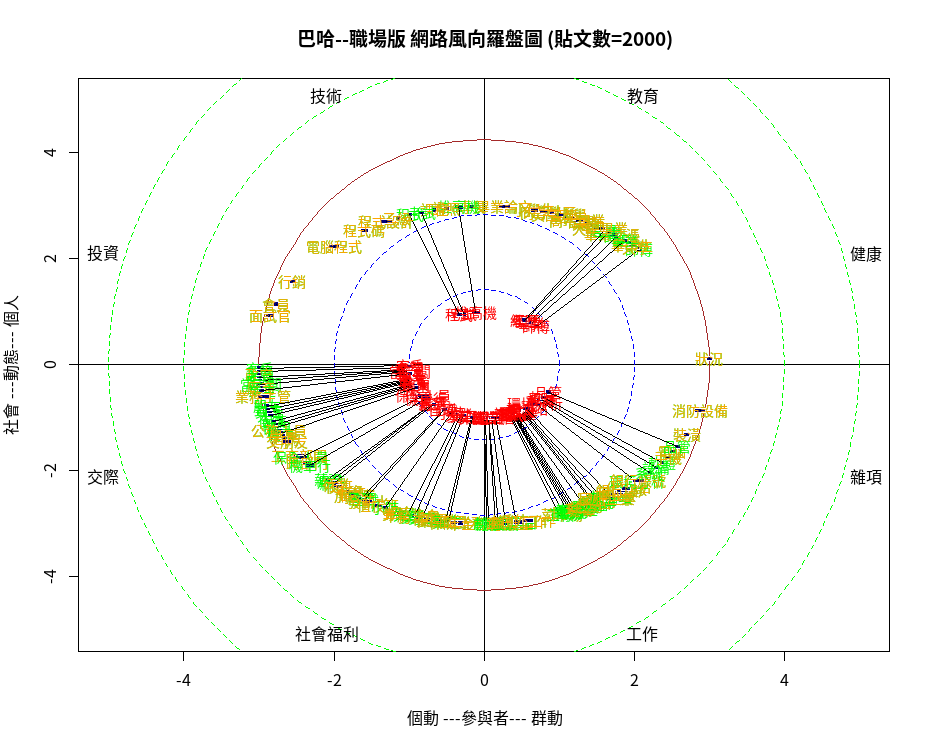
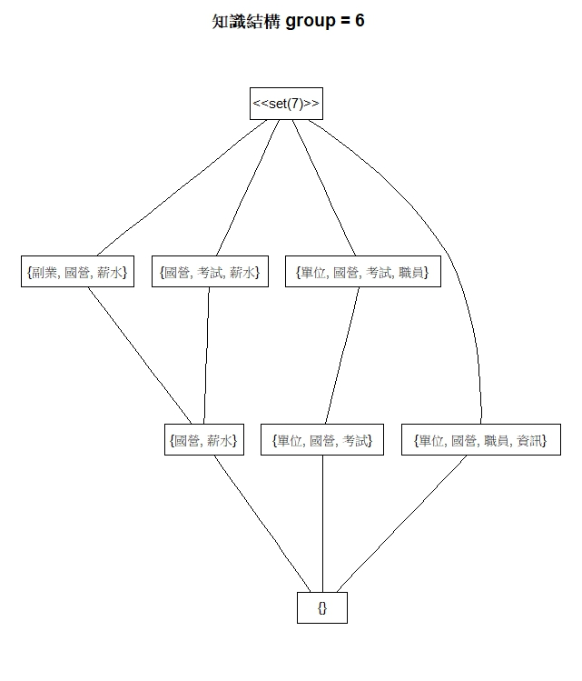
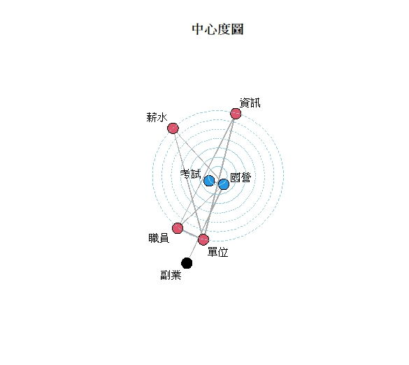

# 巴哈姆特職場甘苦談 100頁貼文數據

# 目錄

__[前言](#前言)__

__[數據來源](#數據來源)__ 

__[1 \. 巴哈姆特-職場甘苦談100頁貼文數據](https://github.com/grant1004/Content-Analysis/blob/main/README.md#1%E5%B7%B4%E5%93%88%E5%A7%86%E7%89%B9-%E8%81%B7%E5%A0%B4%E7%94%98%E8%8B%A6%E8%AB%87100%E9%A0%81%E8%B2%BC%E6%96%87%E6%95%B8%E6%93%9A)__

__[2 . 作者價值模型](https://github.com/grant1004/Content-Analysis/blob/main/README.md#2-%E4%BD%9C%E8%80%85%E5%83%B9%E5%80%BC%E6%A8%A1%E5%9E%8B)__

__[3 .主題價值模型](https://github.com/grant1004/Content-Analysis/blob/main/README.md#3-%E4%B8%BB%E9%A1%8C%E5%83%B9%E5%80%BC%E6%A8%A1%E5%9E%8B)__

__[4 \. 文本分析](https://github.com/grant1004/Content-Analysis/blob/main/README.md#4-%E6%96%87%E6%9C%AC%E5%88%86%E6%9E%90)__
  * __[4\.1 文字雲](https://github.com/grant1004/Content-Analysis/blob/main/README.md#41-%E6%96%87%E5%AD%97%E9%9B%B2)__
  * __[4\.2 巴哈風向圖 ](https://github.com/grant1004/Content-Analysis/blob/main/README.md#42-%E5%B7%B4%E5%93%88%E9%A2%A8%E5%90%91%E5%9C%96)__
  * __[4\.3 知識結構  ](slide19.xml)__

__[總結](slide20.xml)__  __ __  __ __  __    __  __20__

# 前言

__為甚麼要選巴哈姆特__  __\-__  __職場版 

新冠病毒\(COVID\-19\)來了，改變了我們的生活，也影響了職場。於是我看向巴哈姆特\-職場甘苦談，這裡滿滿的都是各種職場的故事，其中不乏疫情下的工作變化與心路歷程。我將進行文本分析，希望能對新冠病毒如何改變職場有更深入的理解，也希望我的研究能為即將面臨職場的同學提供一些實用的參考。

# 數據來源

爬文時間 :  2023/4/20

巴哈姆特\-職場甘苦談

網站來源 :  [https://forum\.gamer\.com\.tw/B\.php?bsn=60561](https://forum.gamer.com.tw/B.php?bsn=60561)

# 1.巴哈姆特-職場甘苦談100頁貼文數據

資料筆數 : 共 13945筆紀錄

發文作者數量 : 共 1492

使用者數量 : 共 4316

主題數量 : 共 2214個主題

日期範圍 : 2013\-06\-06 14:35:23\, 2023\-04\-20 16:06:01

# 1.1  數據樣貌

| title | author | time | gp | bp | mainText | sub.author | sub.time | sub.gp | sub.bp | sub.Text | sub.nch | Rdate |
| :-: | :-: | :-: | :-: | :-: | :-: | :-: | :-: | :-: | :-: | :-: | :-: | :-: |
| 【心得】……. | A00998765 | 2021-04-24 09:48:41 | 267 | 0 | 現在日本時間10點……….. | sonysonyson2 | 2021-04-24 13:04:21 | 7 | 0 | 酷～不過女生配H，排斥的話配音時壓力應該會不小小弟…… | 201 | 2021-04-24 |
| 【心得】…….. | A00998765 | 2021-04-24 09:48:41 | 267 | 0 | 現在日本時間10點……… | o89406 | 2021-04-24 13:25:43 | 1 | 0 | 辛苦樓主了，居然還要配合聲音的工作.... | 21 | 2021-04-24 |

# 1.2 主題分佈

【問題】  __：__ 1382

【討論】  __：__ 238

【心得】  __：__ 216

【閒聊】  __：__ 253

【情報】  __：__ 83

【公告】  __：__ 2

# 2. 作者價值模型

FF  __：__ 回文次數

MM __：__ 回文總字數

D0 __：__ 第一次使用

Df __：__ 最後一次使用

gp\_sum

bp\_sum

| sub.author | FF | MM | D0 | Df | Sgp | Sbp | FF0 | MM0 | Sgp0 | Sbp0 | Y0 | Yf |
| :-: | :-: | :-: | :-: | :-: | :-: | :-: | :-: | :-: | :-: | :-: | :-: | :-: |
| sonysonyson2 | 7 | 747 | 2021-04-03 | 2022-10-20 | 14 | 0 | (1,9] | (99,999] | (9,19] | (-1,0] | 2,021 | 2,022 |
| o89406 | 48 | 3,009 | 2020-11-09 | 2023-03-31 | 26 | 0 | (39,99] | (999,1e+04] | (19,39] | (-1,0] | 2,020 | 2,023 |
| pilka496 | 3 | 151 | 2021-04-24 | 2022-08-18 | 7 | 0 | (1,9] | (99,999] | (1,9] | (-1,0] | 2,021 | 2,022 |
| A00998765 | 3 | 2,573 | 2021-04-24 | 2021-05-21 | 169 | 0 | (1,9] | (999,1e+04] | (99,299] | (-1,0] | 2,021 | 2,021 |
| deagle640 | 2 | 452 | 2021-01-26 | 2021-06-20 | 7 | 0 | (1,9] | (99,999] | (1,9] | (-1,0] | 2,021 | 2,021 |
| eric19940711 | 1 | 265 | 2021-10-31 | 2021-10-31 | 2 | 0 | (0,1] | (99,999] | (1,9] | (-1,0] | 2,021 | 2,021 |

| V1 | (-1,0] | (0,1] | (1,99] | (99,999] | (999,1e+04] | (1e+04,6e+04] | (6e+04,8e+04] | (8e+04,1e+05] | (1e+05,1.1e+05] | Sum |
| :-: | :-: | :-: | :-: | :-: | :-: | :-: | :-: | :-: | :-: | :-: |
| (-1,0] | 0 | 0 | 0 | 0 | 0 | 0 | 0 | 0 | 0 | 0 |
| (0,1] | 11 | 5 | 1336 | 1271 | 62 | 0 | 0 | 0 | 0 | 2685 |
| (1,9] | 0 | 0 | 174 | 948 | 265 | 2 | 0 | 0 | 0 | 1389 |
| (9,19] | 0 | 0 | 0 | 32 | 105 | 3 | 0 | 0 | 0 | 140 |
| (19,39] | 0 | 0 | 0 | 4 | 58 | 4 | 0 | 0 | 0 | 66 |
| (39,99] | 0 | 0 | 0 | 0 | 20 | 9 | 1 | 1 | 0 | 31 |
| (99,299] | 0 | 0 | 0 | 0 | 0 | 3 | 1 | 0 | 1 | 5 |
| Sum | 11 | 5 | 1510 | 2255 | 510 | 21 | 2 | 1 | 1 | 4316 |

_指發表一篇文章的人有 _  _2685_  _人，占了全部文章的_  _62%_

發文超過  200  篇的人有  5  人，其中有一個人發文超過  10  萬個字  		

有  11  個人發了一篇文，但是裡面都沒有文字，說不定是違規，被刪文了

# 2.2作者流量模型

_2021_ 年的使用人數突然急遽上升\, 240人 \-> 1345人\, 增加了 >1000 人\, 這個年份剛好是 covid\-19 最嚴重影響台灣上班族的時間，可能是因為疫情而讓更多人使用職場版

2022年後的使用人數急遽下降\,  這個年份是台灣逐漸解放covid\-19也已經發展完整的對應系統\(隔離、居家上班\)

| V1 | 2013 | 2014 | 2015 | 2016 | 2017 | 2018 | 2019 | 2020 | 2021 | 2022 | 2023 | Sum |
| :-: | :-: | :-: | :-: | :-: | :-: | :-: | :-: | :-: | :-: | :-: | :-: | :-: |
| 2013 | 3 | 0 | 0 | 0 | 0 | 0 | 0 | 0 | 0 | 0 | 0 | 3 |
| 2014 | 0 | 10 | 0 | 0 | 1 | 0 | 0 | 0 | 0 | 2 | 4 | 17 |
| 2015 | 0 | 0 | 30 | 1 | 1 | 0 | 0 | 2 | 9 | 3 | 4 | 50 |
| 2016 | 0 | 0 | 0 | 49 | 0 | 0 | 1 | 1 | 7 | 9 | 13 | 80 |
| 2017 | 0 | 0 | 0 | 0 | 31 | 2 | 0 | 2 | 4 | 8 | 9 | 56 |
| 2018 | 0 | 0 | 0 | 0 | 0 | 64 | 3 | 0 | 8 | 9 | 12 | 96 |
| 2019 | 0 | 0 | 0 | 0 | 0 | 0 | 141 | 5 | 27 | 37 | 34 | 244 |
| 2020 | 0 | 0 | 0 | 0 | 0 | 0 | 0 | 240 | 74 | 58 | 58 | 430 |
| 2021 | 0 | 0 | 0 | 0 | 0 | 0 | 0 | 0 | 1345 | 308 | 183 | 1836 |
| 2022 | 0 | 0 | 0 | 0 | 0 | 0 | 0 | 0 | 0 | 998 | 139 | 1137 |
| 2023 | 0 | 0 | 0 | 0 | 0 | 0 | 0 | 0 | 0 | 0 | 367 | 367 |
| Sum | 3 | 10 | 30 | 50 | 33 | 66 | 145 | 250 | 1474 | 1432 | 823 | 4316 |

# (3) 四個使用職場版超過九年的人

__這四個人最活躍的時間都是  __  __2021 – 2022 __  __疫情發生的時刻__

# 2.3 GP & BP 模型

| V1 | (-1,0] | (0,1] | (1,9] | (9,19] | (19,39] | (39,99] | (99,299] | (299,499] | (499,699] | (699,899] | Sum |
| :-: | :-: | :-: | :-: | :-: | :-: | :-: | :-: | :-: | :-: | :-: | :-: |
| (-1,0] | 1019 | 760 | 1646 | 378 | 239 | 164 | 59 | 1 | 4 | 2 | 4272 |
| (0,1] | 0 | 0 | 0 | 0 | 0 | 0 | 0 | 0 | 0 | 0 | 0 |
| (1,9] | 1 | 0 | 1 | 2 | 0 | 0 | 2 | 0 | 0 | 0 | 6 |
| (9,19] | 0 | 1 | 4 | 1 | 0 | 4 | 1 | 0 | 0 | 0 | 11 |
| (19,39] | 0 | 0 | 2 | 2 | 2 | 3 | 2 | 1 | 0 | 0 | 12 |
| (39,99] | 0 | 0 | 0 | 2 | 0 | 3 | 2 | 0 | 0 | 0 | 7 |
| (99,299] | 0 | 0 | 2 | 1 | 2 | 0 | 1 | 0 | 0 | 0 | 6 |
| (299,499] | 0 | 0 | 0 | 0 | 0 | 0 | 0 | 1 | 0 | 0 | 1 |
| (499,699] | 0 | 0 | 0 | 0 | 0 | 0 | 0 | 0 | 0 | 0 | 0 |
| (699,899] | 0 | 0 | 0 | 0 | 0 | 0 | 0 | 0 | 0 | 0 | 0 |
| (899,2.2e+03] | 0 | 0 | 0 | 0 | 0 | 0 | 0 | 0 | 0 | 1 | 1 |
| Sum | 1020 | 761 | 1655 | 386 | 243 | 174 | 67 | 3 | 4 | 3 | 4316 |

有超過9成的文章都沒有 BP\, 代表這個社群蠻友善的

GP 拿最多的人 總共發表183次文，而且bp是0，他的回文可能和大家很有共鳴

| sub.author | FF | MM | D0 | Df | Sgp | Sbp | FF0 | MM0 | Sgp0 | Sbp0 | Y0 | Yf |
| :-: | :-: | :-: | :-: | :-: | :-: | :-: | :-: | :-: | :-: | :-: | :-: | :-: |
| qbgeneral | 183 | 22,612 | 2020-11-02 | 2023-04-13 | 855 | 0 | (99,299] | (1e+04,6e+04] | (699,899] | (-1,0] | 2,020 | 2,023 |

BP 拿最多的人 總共發表284次文，而且gp也不少，可能發了很多篇廢文所以才會有這麼多BP，而在職場版裡面認同他的想法給GP的大概有30%

| sub.author | FF | MM | D0 | Df | Sgp | Sbp | FF0 | MM0 | Sgp0 | Sbp0 | Y0 | Yf |
| :-: | :-: | :-: | :-: | :-: | :-: | :-: | :-: | :-: | :-: | :-: | :-: | :-: |
| abcgg12 | 284 | 32,359 | 2020-02-06 | 2023-02-04 | 837 | 2,136 | (99,299] | (1e+04,6e+04] | (699,899] | (899,2.2e+03] | 2,020 | 2,023 |

# 3. 主題價值模型

| title | text | postNo | D0 | Df | Nauthor | chCount | postNo0 | chCount0 | nDay | nDay0 |
| :-: | :-: | :-: | :-: | :-: | :-: | :-: | :-: | :-: | :-: | :-: |
| - | 台灣物價比南韓高？ | 6 | 2023-02-28 18:46:05 | 2023-03-01 19:09:16 | 6 | 4,620 | (1,9] | (999,1e+04] | 1 | (0,7] |
| . | 已經離開這行業了分 | 3 | 2022-01-09 12:13:14 | 2022-01-13 03:39:40 | 3 | 939 | (1,9] | (99,999] | 4 | (0,7] |
| 20 | 每年那麼多大學畢業 | 19 | 2022-07-30 04:50:36 | 2022-08-02 17:47:37 | 19 | 2,128 | (9,99] | (999,1e+04] | 3 | (0,7] |

title ：標題

Text：主文

postNo：回文次數

D0：第一次回文時間

Df：最後一次回文時間

chCount ：回文總字數

Nday：討論天數

| nDay0 / chCount | (-1,0] | (0,9] | (9,99] | (99,999] | (999,1e+04] | (1e+04,1e+05] | (1e+05,1e+06] | Sum |
| :-: | :-: | :-: | :-: | :-: | :-: | :-: | :-: | :-: |
| (-1,0] | 0 | 1 | 119 | 414 | 111 | 12 | 0 | 657 |
| (0,7] | 1 | 1 | 20 | 406 | 563 | 63 | 1 | 1055 |
| (7,30] | 0 | 0 | 3 | 72 | 137 | 32 | 1 | 245 |
| (30,100] | 0 | 0 | 0 | 22 | 39 | 25 | 1 | 87 |
| (100,400] | 1 | 0 | 1 | 19 | 40 | 18 | 2 | 81 |
| (400,1.2e+03] | 0 | 0 | 0 | 12 | 41 | 26 | 1 | 80 |
| (1.2e+03,4.3e+03] | 0 | 0 | 0 | 1 | 4 | 6 | 0 | 11 |
| Sum | 2 | 2 | 143 | 946 | 935 | 182 | 6 | 2216 |

-1. 有11個主題的討論時間超過三年

-2. 大部分的文章的討論時間都只有1至2個禮拜，文章的字數是99至1000個字

-3. 假設每一個主題的觀看時間是10分鐘，那巴哈職場版的平均駐留率約 = 0\.23%

# 4. 文本分析

文章篇數：2214 篇

總字數：228757 個字

字數大於2的單詞

刪除所有英文

詞類：名詞\(n\)

# 4.1 文字雲

可以看到左圖   __「老闆」「薪水」__   字形最大，  是出現次數最多的單字，是在巴哈姆特討論最熱絡的主題。

可以看到右圖可以大致分成三類，第一類是和 _人際關係：_   __ __   _「老闆」 「同事」 「主管」_ 第二類是和 _薪水工時：_   __ __   _「薪水」 「時間」 _ 第三類是和 _專業能力：_   __ __   _「經驗」 「能力」_

 __可以看到工程師是唯一有出現在前__    __30__    __個字的職業，代表工程師這個職業的討論度在這十年來是很多人討論的。__ 

# 4.2 巴哈風向圖

在大多數的主題，職場版的討論都是  _偏負面的_  ，大家都是上職場版抱怨工作上的各種事，  _尤其是工作、交際_  這兩個。

有關  __健康的討論__  在職場版出現的次數  _非常低_  。

對於  _偏個人_  的方向，內容都是比較  _偏中性的_  ，  _例如 投資、技術、教育_  。

# 4.3 知識結構

右圖是使用 __聚類__ 後，把  __group__  __ __  __= 6 __ 拿出來做知識結構和中心度。

_這一類裡面都是和國營有關的文章，代表_  _國營_  _是這一類的核心。_

 __｛國營，考試｝是最相關的，代表大家關注的都是考試上國營的主題。__ 

中心度圖最外圍有一個   __副業__   ，是和國營最遠的主題，可以研究是甚麼原因產生出副業這個關聯 。

# 巴哈姆特-職場甘苦談版 總結

職場甘苦談版，使用的流量最高峰期是台灣進入疫情並開始隔離以及遠距上班的時候，疫情減緩後， _目前的流量大約只剩高峰期的三成左右_ 。

雖然在疫情時候，流量非常的高，但是大家對於 _遠距工作、隔離之類的主題，討論非常的少_ ，大部分的內容是以工作上發生的故事為主體，而內容大多是和 _老闆、薪水、工時_ 的問題，有關 _就業、專業技術相關的主題是少數_ 。

在這個版當中有 _超過八成的文章_ ，文章的內容都是 _負面取向_ ，剩下的文章都是中性。

